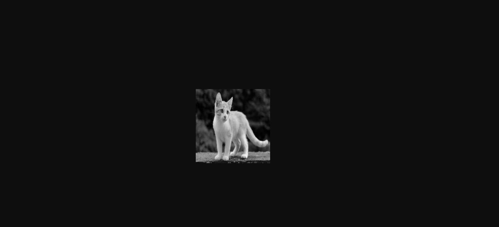
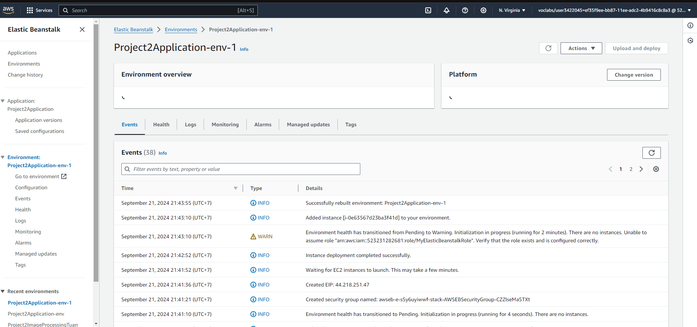

Domain: http://project2v1.us-east-1.elasticbeanstalk.com/
Sample get image URL: http://project2v1.us-east-1.elasticbeanstalk.com/filteredimage?image_url=https://upload.wikimedia.org/wikipedia/commons/b/bd/Golden_tabby_and_white_kitten_n01.jpg
Resule of sample URL(above): 
Screenshot of the elastic beanstalk application dashboard after deployment 
Note: I cannot add AWSElasticBeanstalkFullAccess to IAM policy, so at the elastic beanstalk application dashboard have warning about it. But my application and URL can work normally
Git repository: https://github.com/yamto2304/Cloud-Developer_Udacity_project-2